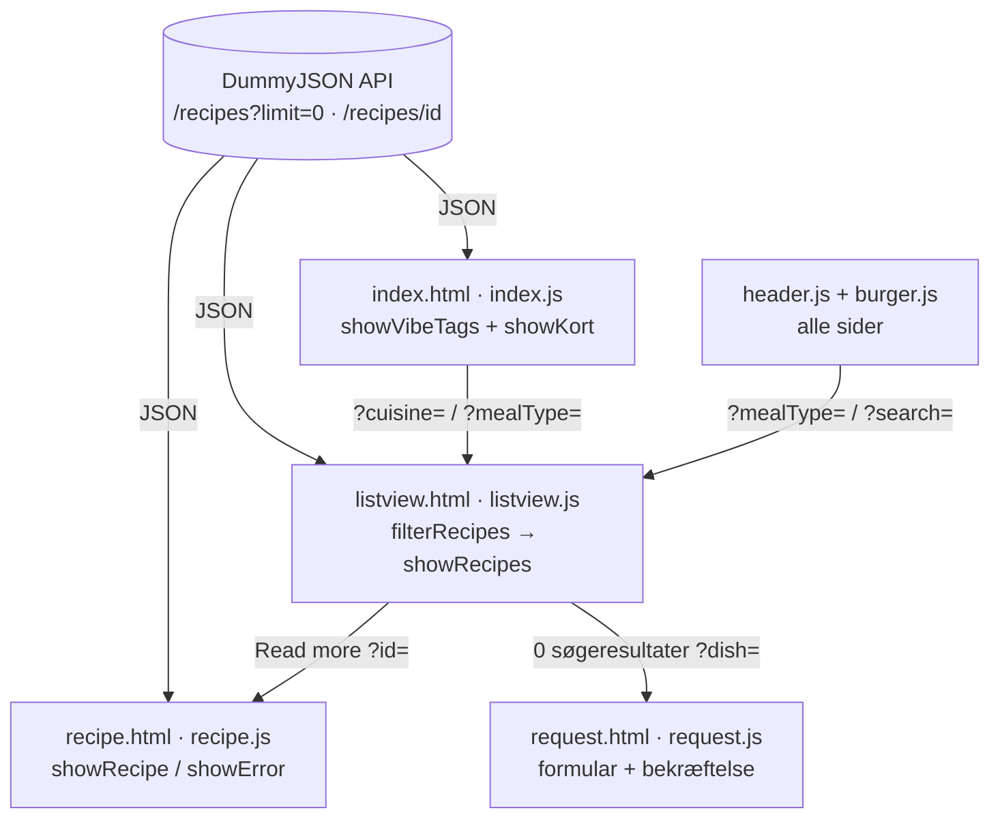

# TEMA8-GRUPPE9_RECIPES

```mermaid
flowchart TD
    API[(DummyJSON API<br>/recipes?limit=0 · /recipes/id)]
    HDR[header.js + burger.js<br>alle sider]
    IDX[index.html · index.js<br>showVibeTags + showKort]
    LST[listview.html · listview.js<br>filterRecipes → showRecipes]
    REC[recipe.html · recipe.js<br>showRecipe / showError]
    REQ[request.html · request.js<br>formular + bekræftelse]

    API -- JSON --> IDX
    API -- JSON --> LST
    API -- JSON --> REC
    IDX -- "?cuisine= / ?mealType=" --> LST
    HDR -- "?mealType= / ?search=" --> LST
    LST -- "Read more ?id=" --> REC
    LST -- "0 søgeresultater ?dish=" --> REQ
```